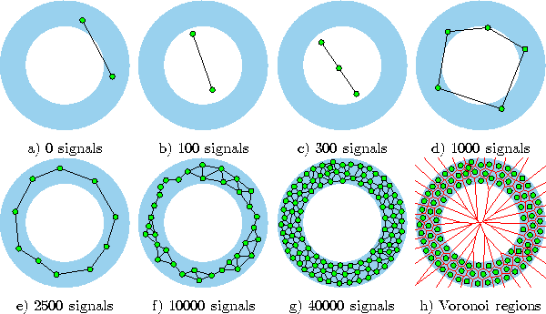

# GrowingNeuralGas

Authors: 
  - [Morsinaldo de Azevedo Medeiros](https://github.com/Morsinaldo)
  - [Thaís de Araújo de Medeiros](https://github.com/thaisaraujo2000)

Adapted from [GUILLE, Adrien. Growing Neural Gas](https://github.com/AdrienGuille/GrowingNeuralGas)

## Theoretical Foundation

A Growing Neural Gas (GNG) é um algoritmo de aprendizado não supervisionado desenvolvido por Bernd Fritzke em 1994 em seu artigo [A Growing Neural Gas Network Learns Topologies](https://www.researchgate.net/publication/2428368_A_Growing_Neural_Gas_Network_Learns_Topologies). De forma geral, ele é uma extensão do modelo Neural Gas (NG) proposto por Thomas Martinetz, Klaus Schulten e Ernst-Jürgen Beyer em 1991 e é utilizado para realizar a clusterização de dados, ou seja, agrupar amostras similares em conjuntos.

Seus conceitos são inspirados no crescimento de redes neuronais biológicas, ou seja, essas redes possuem a capacidade de se adaptar e crescer de forma incremental à medida que recebem mais informações. Dessa forma, a ideia central do GNG é construir um grafo que representa a topologia dos dados, onde cada nó do grafo representa um protótipo ou um centroide do cluster.

<p align='center'>



</p>

A construção do grafo começa com dois nós iniciais conectados por uma aresta. Em seguida, à medida que novos dados são apresentados ao algoritmo, os nós existentes são atualizados para se aproximarem dos dados, e novos nós são adicionados para capturar regiões do espaço de entrada ainda não representadas. A adição de novos nós é controlada com base em uma medida de erro, que indica a necessidade de expandir o grafo para melhor capturar as características dos dados.

Durante a execução do algoritmo GNG, ocorrem dois tipos de atualizações: atualização de vencedor e atualização de vizinhos. A atualização de vencedor envolve a seleção do nó vencedor, ou seja, o nó mais próximo do dado de entrada, e a atualização desse nó para se aproximar ainda mais do dado. A atualização de vizinhos envolve a atualização dos nós vizinhos do nó vencedor para capturar as características dos dados próximos.

À medida que o algoritmo progride, os nós menos importantes podem ser removidos do grafo com base em critérios pré-definidos, como a idade do nó (tempo desde a última atualização) ou a importância do nó em termos de erros acumulados. Isso permite que o grafo se adapte e seja capaz de lidar com mudanças na distribuição dos dados ao longo do tempo.


## How to use

Para executar este repositório, você pode criar um ambiente virtual utilizando o conda, por exemplo, com as bibliotecas do arquivo [environment.yml](./environment.yml) com o seguinte comando:

```
conda create -f environment.yml
```

Em seguida, ative o ambiente com o comando:

```
conda activate gng
```

Para utilizar a classe criada, basta apenas instaciar o objeto da classe `GrowingNeuralGas` e chamar o método `fit()`, como mostra o exemplo abaixo.
Instantiate a GNG object with some data, then fit the neural network:
```python
from gng import GrowingNeuralGas
gng = GrowingNeuralGas(data)
gng.fit_network(e_b=0.1, e_n=0.006, a_max=10, l=200, a=0.5, d=0.995, passes=8, plot_evolution=True)
```

__Params:__
- `e_b`: Taxa de aprendizado para mover a unidade mais próxima do vetor de entrada durante o treinamento. Ou seja, esse parâmetro indica o quanto o nó vencedor irá se mover em direção aos dados.
- `e_n`: Taxa de aprendizado para mover as unidades vizinhas da unidade mais próxima do vetor de entrada durante o treinamento. Ou seja, esse parâmetro ele indica o quanto os nós vizinhos do nós vencedor irão se mover em direção aos dados.
- `a_max`: Idade máxima de uma conexão na rede neural. Se a idade de uma conexão entre unidades exceder a_max, ela será removida durante o treinamento.
- `l`: Parâmetro que determina a frequência de criação de novas unidades durante o treinamento. A cada `l` iterações, uma nova unidade pode ser inserida na rede neural.
- `a`: Fator de redução da variável de erro das unidades vizinhas durante a criação de novas unidades.
- `d`: Fator de redução da variável de erro de todas as unidades após cada iteração do treinamento.
- `passes`: Número de iterações completas sobre o conjunto de dados de treinamento.
- `plot_evolution`: Um valor booleano que indica se a evolução da rede neural deve ser plotada após cada criação de unidade.

## Example

Este exemplo mostra como você pode gerar um dataset sintético utilizando a bilbioteca do scikit-learn e treinar o modelo.

```python
    from gng import GrowingNeuralGas
    from sklearn import datasets
    from sklearn.preprocessing import StandardScaler
    
    print('Generating data...')
    data = datasets.make_moons(n_samples=2000, noise=.05) 
    data = StandardScaler().fit_transform(data[0])
    print('Done.')
    print('Fitting neural network...')
    gng = GrowingNeuralGas(data)
    gng.fit_network(e_b=0.1, e_n=0.006, a_max=10, l=200, a=0.5, d=0.995, passes=8, plot_evolution=True)
    print('Found %d clusters.' % gng.number_of_clusters())
    gng.plot_clusters(gng.cluster_data())
```

Rodando o arquivo [example.py](./example.py), você vai obter o seguinte resultado:

    Preparing data...
    Done.
    Fitting neural network...
       Pass #1
       Pass #2
       Pass #3
       Pass #4
       Pass #5
       Pass #6
       Pass #7
       Pass #8
    Found 2 clusters.


### Clusters


### Network properties


### Global error vs. number of passes


### Accumulated local error vs. total number of iterations


### Video Moons
[](./videos/moons.mov)

### Video Circles
[](./videos/circles.mov)